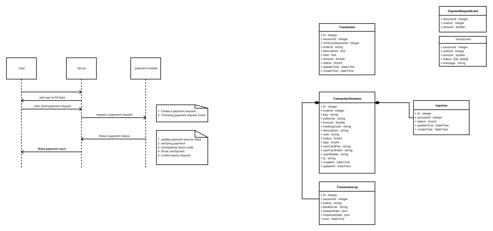

# How to install this module:

Step1: Add flowing line to require part of `composer.json` :
```
"aminkt/yii2-payment-module": "*",
```

Or run bellow command  :
```
composer require aminkt/yii2-payment-module
```

Step2: Add flowing lines in your application config:

```php
'payment' => [
    'class' => aminkt\yii2\payment\Payment::class,
    'minAmount' => 100, // Min availbale money that can pay by gates.
    // If you want, same as minAmount you can set maxAmount.
    'maxAmount' => 1000000,
    // In Development you can uncomment below line to enable by pass mode.This config will pass the gates.
    // 'enableByPass' => true,
    'orderClass' => \common\models\Order::class,    Your order model class name.
    // Add this part to add your own gates.
    'components' => [
        'payment' => [
            'class' => aminkt\yii2\payment\components\Payment::class,
            // Uncomment below line if you wnat change you default callback address.
            // 'callback' => ['/v1/payment/verify'],
            'bankTimeout' => 60 * 30, // Max time user can be in bank site.
            'encryptKey' => 'wumBOOH04e', // This key will used to generate security token
            'blockTime' => 10, // How many times system allow to a user have risky actions.
            'gates' => [
               'Parsian' => [
                   'class' => \aminkt\yii2\payment\gates\Parsian::class,
                   'identityData' => [
                       'pin' => 'x8Xd1tR4So8kL50d3EV1',
                       'terminal' => '92133477'
                   ]
               ],
               'BehPardakht' => [
                   'class' => \aminkt\yii2\payment\gates\MellatGate::class,
                   'identityData' => [
                       'terminalId' => '****',
                       'userName' => '****',
                       'password' => '****',
                       'payerId' => 0,
                       'webService' => 'https://bpm.shaparak.ir/pgwchannel/services/pgw?wsdl',
                       'bankGatewayAddress' => 'https://bpm.shaparak.ir/pgwchannel/startpay.mellat',
                   ]
               ],
           
           ]
        ]
    ]
]
```

> All time please add Mellat Bank gate in down of gates list because it may make issue in automatic gate selector.
> Mellat gate throw an exception when it's not available that system can not catch it so the processes may become failed.
> If you can fix this please contribute.

Step3: Create your own order model and implement `aminkt\yii2\payment\interfaces\OrderInterface` in your order model.
Using order model in this module is required.

> Note: Using a table as order model is an standard pattern to keep track of every thing you try to sale. refer
this link to read more: [http://www.databaseanswers.org/data_models/customers_and_orders/index.htm](http://www.databaseanswers.org/data_models/customers_and_orders/index.htm)

---
**Database Migrations**

Before usage this extension, we'll also need to prepare the database.

```
php yii migrate --migrationPath=@vendor/aminkt/yii2-payment-module/migrations
```

# Usage:

In your code when you want create a payment request use below code:
```php
$payment = \aminkt\payment\Payment::getInstance()->payment;
$data = $payment->payRequest($orderModel);
```

> Use `$orderModel` to make a connection between your order table and payment data. by defining this you can access to your orders later from payment logs.

When users paid money, they will redirect in a page in you site that you defined.
By default user will redirect to `/payment/default/verify` route.

For changing default call back page use below code:

```php
$payment = \aminkt\payment\Payment::getInstance()->payment;
$payment->callback = ['/your-controller/your-action']; // callBack give an array defined a route.
```

> Also you can set callback address globally in module configuration.

In your verify page use below code to verify payment:
```php
$verify = Payment::getInstance()
            ->getPayment()
            ->verify();

if($verify) {
    // Payment was successfull.
} else {
    // Paymen verify become failed.
}
```
`$verify` is `false` if verify action become failed and otherwise return an true.


# Security

Module will check security issues and log them in yii2 log system.
You can also define below attribute in payment component config to change default behavior of security system.


| Attribute               | Default value | Description |
|-------------------------|---------------|-------------|
| encryptKey              | Null          | Encrypt key should be safe and long to encrypt payment token and is required.|
| bankTimeout             | Null          | Time that system can validate bank response. Default is null. Set time in second that if user returned from bank then system accept the response. If user do not return from bank in defined time then response will not accept. |
| blockTime               | 86400         | This value define if a user blocked how much should prevent action from that. If set null for ever considered. Value should be in second |
| allowedCredentialErrors | 5             | Max allowed times that a user can has credential errors |


# Gate configuration


Every gate has some configuration. In this module prepared some default gates that you can use.

If you want create your own gate please refer to [Create gate class](#create-gate-class) section.

You can contribute your gates to this report and help me to improve productivity.

List of gates:


| Name                            | Bank                                   | Contributor                        | Configuration array                   |
|---------------------------------|----------------------------------------|------------------------------------|---------------------------------------|
| `\aminkt\yii2\gates\Sep`        | [Saman](https://www.sb24.com)          | Amin Keshavarz <ak_1596@yahoo.com> | [Sep gate configuration](#sep)        |
| `\aminkt\yii2\gates\MellatGate` | [Mellat](http://behpardakht.com)       | Amin Keshavarz <ak_1596@yahoo.com> | [Sep gate configuration](#mellatgate) |
| `\aminkt\yii2\gates\Parsian`    | [Parsian](https://www.parsian-bank.ir) | Amin Keshavarz <ak_1596@yahoo.com> | [Sep gate configuration](#parsian)    |
| `\aminkt\yii2\gates\IranKish`   | [IranKish](http://www.kiccc.com)       | Amin Keshavarz <ak_1596@yahoo.com> | [Sep gate configuration](#irankish)   |
| `\aminkt\yii2\gates\ZarinPal`   | [Zarinpal](http://zarinpal.com)        | Amin Keshavarz <ak_1596@yahoo.com> | [Sep gate configuration](#zarinpal)   |


# Create gate class


Gate configurations
------------

Sep
---------
```php
"Sep" => [
    'class' => \aminkt\payment\lib\Sep::className(),
    'identityData' => [
        'MID' => '******',
        'password' => '******',
        'bankGatewayAddress' => 'https://sep.shaparak.ir/payment.aspx',
        'webService' => "https://sep.shaparak.ir/payments/referencepayment.asmx?WSDL",
    ]
],

```


MellatGate
---------
```php
'BehPardakht' => [
    'class' => \aminkt\yii2\payment\gates\MellatGate::class,
    'identityData' => [
        'terminalId' => '****',
        'userName' => '****',
        'password' => '****',
        'payerId' => 0,
        'webService' => 'https://bpm.shaparak.ir/pgwchannel/services/pgw?wsdl',
        'bankGatewayAddress' => 'https://bpm.shaparak.ir/pgwchannel/startpay.mellat',
    ]
],
```

Parsian
--------
```php


```

IranKish
--------
```php


```

ZarinPal
--------
```php
"Zarinpal" => [
    'class' => \aminkt\payment\lib\ZarinPal::className(),
    'identityData' => [
        'merchantCode' => '******',
        'redirectUrl' => 'https://zarinpal.com/pg/StartPay/%u',
        'payRequestUrl' => 'https://www.zarinpal.com/pg/rest/WebGate/PaymentRequest.json',
        'verifyRequestUrl' => 'https://www.zarinpal.com/pg/rest/WebGate/PaymentVerification.json',
        'isZarin' => false,
        'enableSandbox' => false
    ]
],

```

# Reports:


In you backend panel you can use module routes to see various reports include Transaction sessions, payment logs, Inquiry requests and bank shortage data.


# Structure of tables and classes:

{ width: 100%; }