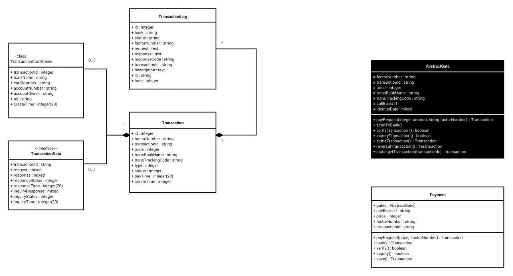

How to install this module:

Step1: Copy `payment` directory in your modules folder.

Step2: Add flowing code into your `bootstrap.php` file in your project.
```
Yii::setAlias('payment', 'PATH_TO_MODULE_DIRECTORY/payment');
```

Step3: Add flowing lines in your application backend config:

```
'payment' => [
    'class' => 'payment\Payment',
    'controllerNamespace' => 'payment\controllers\backend',
],
```

Step4: Add flowing lines in your application frontend config:

```
'payment' => [
    'class' => 'payment\Payment',
    'controllerNamespace' => 'payment\controllers\frontend',
],
```


Structure of tables and classes:

